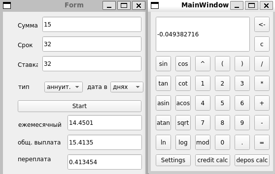

# Qt_calc

Простой калькулятор с графическим интерфейсом на основе Qt.

## Описание

Qt_calc — это минималистичное приложение-калькулятор, реализованное с использованием Qt Widgets. Позволяет выполнять базовые арифметические операции и демонстрирует быстрый старт в разработке GUI-приложений на C++/Qt.

## Возможности

- Сложение, вычитание, умножение, деление и тригонометрические выражения
- Очистка ввода
- Обработка деления на ноль
- Удобный и понятный интерфейс
- Кредитный калькулятор 

> 

## Требования

- Qt 6.x и выше (Qt Widgets)
- Компилятор C++ (GCC, Clang, MSVC)
- Qt Creator (рекомендуется для облегчения сборки)
